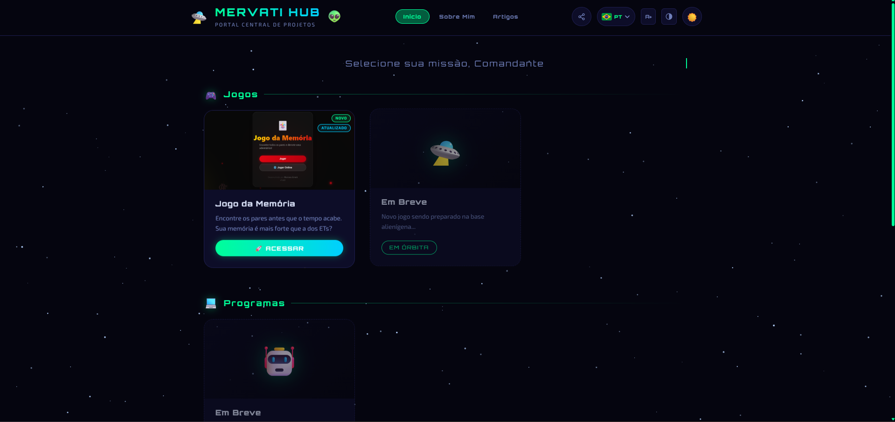
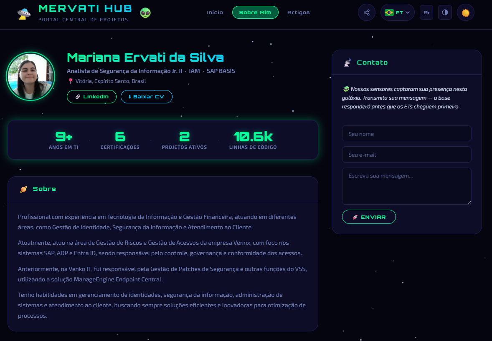
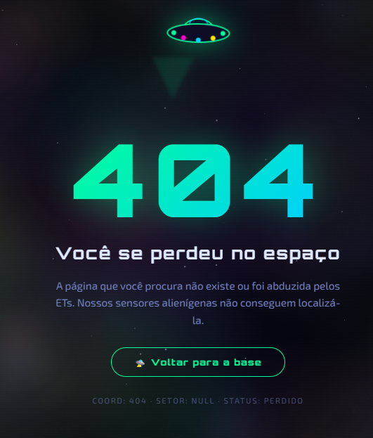
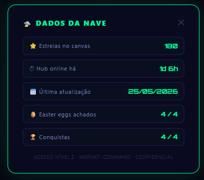
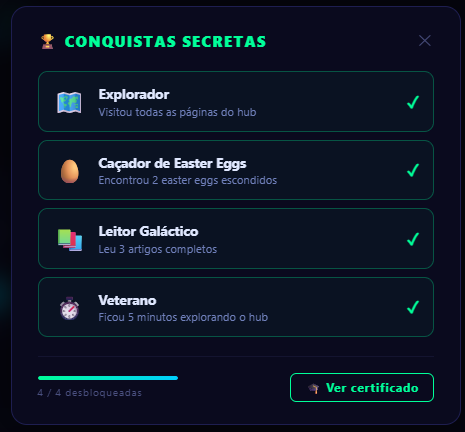

# 🛸 Mervati Hub

<p align="center">
  
  
  
  
  
  
  
</p>

> Portal central de projetos de Mariana Ervati — tema futurista alienígena com animações, modo escuro padrão e design responsivo.

🔗 **Acesse:** [mervati.github.io](https://mervati.github.io)

---

## 🖼️ Screenshots

### Hub Principal


### Sobre Mim


### Página 404 — Nebulosa Galáctica


### Painel Secreto (double-click no logo)


### Conquistas Secretas


---

## 📄 Páginas

| Página | URL | Descrição |
|---|---|---|
| Hub principal | `/` | Portal com seções Jogos, Programas e Sites |
| Sobre Mim | `/sobre.html` | Perfil profissional completo com contato, heatmap de skills e CV |
| Artigos | `/artigos.html` | Posts sobre IAM, LGPD e SAP BASIS |
| 404 / Erros | `/404.html` | Página de erro personalizada com nebulosa animada; suporta `?code=403` e `?code=500` |

---

## ✨ Funcionalidades

- 🌙 **Modo escuro** como padrão, alternável para modo claro com preferência salva
- ⭐ **Campo de estrelas animado** no canvas com estrelas cadentes amarelas e parallax no mouse; estrelas coloridas no tema claro
- 🌌 **Nebulosa galáctica** no canvas da página 404 — 220 nuvens coloridas com drift suave em loop
- 🚨 **Erros personalizados** — mensagens distintas para código 403, 404 e 500 via parâmetro `?code=` na URL
- 🎮 **Cards por categoria** — Jogos, Programas e Sites — com efeito flutuante e brilho no hover
- 🏷️ **Badges automáticos nos cards** — NOVO (repositório criado há ≤ 30 dias) e ATUALIZADO (último commit ≤ 7 dias), calculados via GitHub API com cache de 6h em localStorage
- 🔤 **Efeito de digitação** na frase de missão ao carregar a página
- ✦ **Glitch no título** MERVATI HUB a cada intervalo aleatório
- 🔗 **Botão de compartilhar** com dropdown para WhatsApp, LinkedIn, X e copiar link
- 🌍 **Seletor de idioma** — PT-BR, English e Español com bandeiras reais e detecção automática por IP
- ♿ **Acessibilidade** — botão A+ (aumentar fonte) e botão de alto contraste em todas as páginas
- 🖱️ **Scrollbar personalizada** — fina, com cores do tema neon, compatível com Chrome/Firefox/Safari
- ✏️ **Seleção de texto** em verde neon (::selection) para manter a identidade visual em todo o site
- 🥚 **Easter eggs** — sequências de teclas secretas: `ovini`, `et's`, `easteregg`, `ervati`; agite o celular para disparar o OVNI (shake easter egg)
- 🏆 **Conquistas secretas** — sistema de badges desbloqueáveis (explorador, caçador, leitor, veterano) com painel acessível clicando no 👽 do logo; progresso salvo em localStorage entre sessões
- 🛸 **Painel secreto "Dados da Nave"** — acessível com double-click no logo; exibe estrelas no canvas, tempo online do hub (via GitHub API), data do último commit, easter eggs achados e conquistas desbloqueadas
- 📱 **Shake easter egg mobile** — agitar o celular aciona o OVNI e chuva de emojis; iOS 13+ com solicitação de permissão automática no primeiro toque
- 🎓 **Certificado alienígena** — gerado no canvas e disponível para download como PNG ao encontrar todos os easter eggs
- 💻 **Consola do navegador** — mensagem artística com ASCII art e dados do visitante, exibida ao abrir o DevTools em qualquer página
- 🎄 **Temas sazonais automáticos** — campo de estrelas troca para flocos de neve (1–25 dez), corações (11–17 fev), fantasmas/abóboras (28 out–3 nov) ou fogos de artifício (29 dez–4 jan) sem nenhuma ação do usuário
- 👽 **Página Sobre Mim** — layout 2 colunas com sidebar de contato sticky, stats animados, botão de CV, links de verificação de certificações, formulário Formspree
- 📊 **Heatmap de skills** — mapa de intensidade de uso por ano (8 habilidades × 8 anos) na página Sobre Mim, com tooltip ao hover e legenda de nível
- 📈 **Stat de linhas de código** — busca bytes via GitHub Languages API nos repositórios, converte em linhas e cacheia 24h no localStorage
- 📝 **Página Artigos** — 4 artigos sobre IAM, LGPD e SAP BASIS com filtros por categoria e modal de leitura
- 🟢 **Badge de status** no rodapé — consulta a API do GitHub Status em tempo real, tooltip explicativo ao hover em 3 idiomas

---

## 🗂️ Estrutura

```
mervati.github.io/
├── index.html       # Hub principal
├── sobre.html       # Página Sobre Mim
├── artigos.html     # Página de artigos
├── 404.html         # Página de erro personalizada (suporta ?code=403/500)
├── style.css        # Estilos globais
├── sobre.css        # Estilos exclusivos da página Sobre Mim
├── artigos.css      # Estilos exclusivos da página Artigos
├── lang.js          # Internacionalização (PT-BR / EN / ES) + detecção por IP
├── script.js        # Animações, tema, compartilhar, acessibilidade, easter eggs, status badge, consola, temas sazonais, nebulosa, badges, painel secreto, shake, heatmap
├── conquistas.js    # Sistema de conquistas secretas, certificado canvas e painel de badges
├── artigos.js       # Filtros, animações e modal da página Artigos
├── favicon.svg      # Ícone OVNI na aba do navegador
├── cv.pdf           # Currículo para download
└── images/
    ├── memoria.png          # Screenshot do Jogo da Memória
    ├── thalita.png          # Screenshot do site Thalita Jantorno
    ├── avatar.jpg           # Foto de perfil
    └── screenshots/         # Screenshots do hub para o README
        ├── screenshot-index.png
        ├── screenshot-sobre.png
        ├── screenshot-404.png
        ├── screenshot-painel-secreto.png
        └── screenshot-conquistas.png
```

---

## 🎮 Projetos

### Jogos
| Projeto | Link |
|---|---|
| Jogo da Memória v1.5.0 | [mervati.github.io/Jogo-da-Memoria](https://mervati.github.io/Jogo-da-Memoria) |

### Sites
| Projeto | Link |
|---|---|
| Thalita Jantorno — Fotografia de Eventos | [mervati.github.io/thalita-jantorno](https://mervati.github.io/thalita-jantorno/) |

---

## 📦 Changelog

### v1.8.0 — 25/05/2026
- **Nebulosa galáctica** na página 404: canvas com 220 nuvens coloridas em drift suave substituindo o starfield padrão
- **Erros personalizados por código**: mensagens distintas para 403 (acesso negado), 404 (não encontrado) e 500 (erro do servidor) via parâmetro `?code=` na URL — sem necessidade de múltiplos arquivos HTML
- **Painel secreto "Dados da Nave"**: acessível com double-click no logo — exibe estatísticas em tempo real: estrelas no canvas, tempo online do hub (calculado via GitHub API), data do último commit, easter eggs achados e conquistas desbloqueadas
- **Shake easter egg mobile**: agitar o dispositivo dispara o OVNI e chuva de emojis alienígenas; iOS 13+ com solicitação de permissão DeviceMotion no primeiro toque
- **Heatmap de skills** na página Sobre Mim: mapa de intensidade de uso de 8 habilidades ao longo de 8 anos, com tooltip ao hover e legenda de nível
- **Seleção de texto em verde neon**: `::selection` e `::moz-selection` com a cor de destaque do tema em todo o site
- **Scrollbar personalizada**: fina e com cores neon via `::webkit-scrollbar` + `scrollbar-width: thin`, compatível com Chrome, Firefox e Safari
- **Badges automáticos nos cards**: NOVO (≤ 30 dias desde a criação do repo) e ATUALIZADO (≤ 7 dias desde o último commit), ambos podendo aparecer juntos — datas calculadas pela GitHub API com cache de 6h em localStorage; basta adicionar `data-repo="mervati/nome-do-repo"` ao card
- **Estrela cadente amarela**: cor da shooting star atualizada para dourado/amarelo (`rgba(255,220,0,…)`)
- **Pausa de animação em aba oculta**: `visibilitychange` + flag `animPaused` para suspender o loop de `requestAnimationFrame` quando a aba não está visível, economizando CPU

### v1.7.0 — 25/05/2026
- Sistema de conquistas secretas (`conquistas.js`) com 4 badges desbloqueáveis: Explorador (todas as páginas), Caçador (2 easter eggs), Leitor Galáctico (3 artigos), Veterano (5 min no site)
- Painel de conquistas acessível clicando no 👽 do logo, com barra de progresso e estado de cada badge
- Certificado alienígena gerado no canvas com starfield, bordas neon, ID único e download como PNG — desbloqueado ao encontrar todos os 4 easter eggs
- Mensagem artística na consola do navegador: ASCII art, aviso de segurança, links e dados do visitante detectados em tempo real
- Temas sazonais automáticos no canvas: flocos de neve (1–25 dez), corações (11–17 fev), Halloween (28 out–3 nov), fogos de artifício (29 dez–4 jan)
- Stat de linhas de código na Sobre Mim: GitHub Languages API nos 3 repos, cache 24h em localStorage, valor imediato no HTML sem delay visual
- Tooltip explicativo no badge de status ao hover (3 idiomas)
- Imagem do card Thalita Jantorno atualizada para thalita.png

### v1.6.0 — 25/05/2026
- Badge de status no rodapé de todas as páginas: consulta a API pública do GitHub Status e exibe se o GitHub Pages está operacional, com instabilidade ou indisponível — sem conta, sem chave de API

### v1.5.0 — 25/05/2026
- Nova página Artigos (`artigos.html`) com 4 artigos originais sobre IAM, LGPD e SAP BASIS
- Filtros por categoria (IAM, LGPD, SAP BASIS, Todos) com animação de entrada
- Modal de leitura com conteúdo completo, fecha com Esc ou clique fora
- Link "Artigos" adicionado à navegação de todas as páginas
- Página Sobre Mim redesenhada: layout 2 colunas com sidebar de contato sticky
- Stats animados (anos em TI, certificações, projetos ativos) com IntersectionObserver
- Formulário de contato via Formspree com feedback de envio em 3 idiomas
- Botões de download de CV e verificação de certificações Udemy
- Easter eggs: `ovini` (OVNI voa pela tela), `et's` (chuva de 👽), `easteregg` (Matrix), `ervati` (mensagem alienígena)
- Botões de acessibilidade A+ (fonte grande) e alto contraste em todas as páginas
- Estrelas coloridas no tema claro; 404.html recebeu footer e nav completa

### v1.4.0 — 25/05/2026
- Seletor de idioma com bandeiras reais (PT-BR, English, Español)
- Detecção automática de idioma pelo IP: Brasil → PT-BR, países hispanófonos → ES, demais → EN
- Preferência salva em localStorage — escolha manual tem prioridade sobre a detecção
- Tradução completa de todas as páginas: nav, cards, página Sobre Mim, experiência, competências, formação e certificações

### v1.3.0 — 25/05/2026
- Card Thalita Jantorno adicionado na seção Sites com imagem preview, descrição e botão de acesso

### v1.2.0 — 24/05/2026
- Favicon SVG de OVNI adicionado — visível na aba do navegador em todas as páginas

### v1.1.0 — 24/05/2026
- Barra de navegação no header com links Início e Sobre Mim
- Página Sobre Mim completa: perfil, experiência, competências, formação, certificações
- Foto de perfil e anel giratório animado no avatar
- Efeito scramble no nome ao passar o mouse
- Botão de compartilhar com dropdown (WhatsApp, LinkedIn, X, copiar link)
- Cards "Em Órbita" com opacidade 60%

### v1.0.0 — 24/05/2026
- Criação do hub com tema futurista alienígena
- Seções Jogos, Programas e Sites com cards animados
- Modo escuro padrão com alternância para modo claro
- Campo de estrelas no canvas com estrelas cadentes e parallax
- Efeito de digitação na frase de missão
- Glitch aleatório no título
- Animação de entrada dos cards via IntersectionObserver
